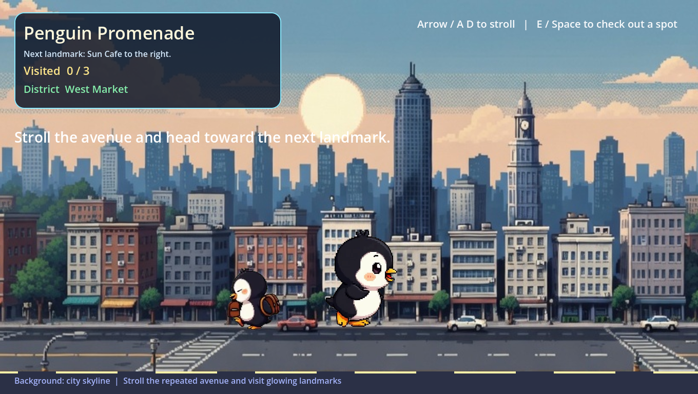
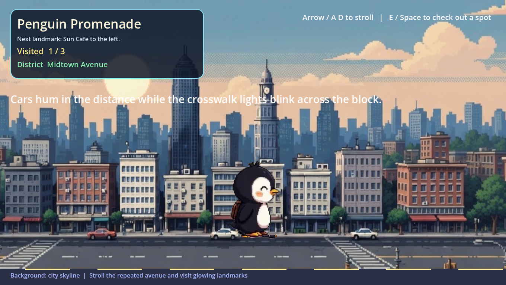
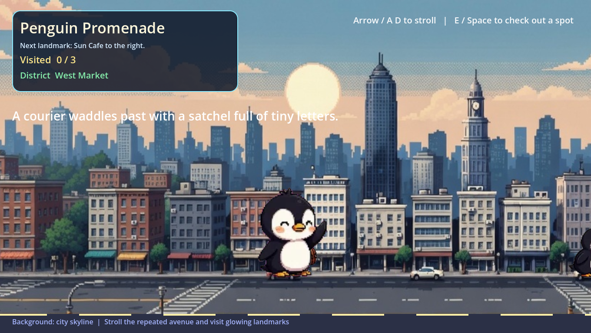

# Penguin Promenade

[](https://github.com/Sunwood-ai-labs/penguin-promenade/actions/workflows/ci.yml)
[](https://sunwood-ai-labs.github.io/penguin-promenade/)
[](https://godotengine.org/)

Godot と Codex App を使った CLI-first の実験的な街歩きゲームです。
animated WebP のペンギン素材をプレイヤー、ランドマーク用モーション、町の住人へ再構成して、夕暮れの通りをゆっくり歩ける小さな横スクロール体験にまとめています。

[English README](README.md) | [ドキュメント](https://sunwood-ai-labs.github.io/penguin-promenade/) | [Issues](https://github.com/Sunwood-ai-labs/penguin-promenade/issues)

## 特徴

- Godot と Codex App を使った CLI-first ワークフローで制作しています。
- 専用の走行 WebP に加えて、残りの WebP も待機、リアクション、NPC として再利用しています。
- Godot の headless smoke test を用意していて、街歩きの基本ループを CI 上で確認できます。
- `uv` 管理の Python ツールで見た目の bounds を計測し、キャラクターのスケール合わせを補助しています。

## プレイ画面



HUD の案内を見ながら、夕暮れの通りを落ち着いたテンポで歩いていくゲームです。



光るランドマークの近くで操作すると、プレイヤーのポーズが切り替わって小さなリアクションが入ります。



小さめのペンギン住人がランダム配置で現れるので、歩いているだけでも街に動きが出ます。

## 遊び方

1. Windows に Godot `4.6.1` を用意します。
2. リポジトリのルートで Godot を起動します。

```powershell
<Godotへのパス>\Godot_v4.6.1-stable_win64.exe --path .
```

操作方法:

- `Left` / `Right` または `A` / `D`: 通りを歩く
- `E` / `Space` / マウスクリック: 近くのランドマークを調べる
- HUD の案内に従って 3 つのランドマークを巡りつつ、町の住人たちの動きを眺める

## 開発メモ

Python ツールは `uv` を使います。

```powershell
uv sync
uv run python tools\measure_animation_metrics.py assets\player_frames\run assets\tiles_frames\tile_09
```

Godot の smoke test:

```powershell
<Godotへのパス>\Godot_v4.6.1-stable_win64_console.exe --headless --path . --script res://tests/smoke_test.gd
```

ドキュメントサイトのローカルビルド:

```powershell
cd docs
npm ci
npm run docs:build
```

`v0.1.0` 用のリリースノートヘッダー画像を Godot から再生成:

```powershell
<Godotへのパス>\Godot_v4.6.1-stable_win64.exe --path . --script res://tests/capture_release_notes_header.gd
```

GitHub Release を publish すると、Windows 向けビルドが自動で作成されて Release Asset に添付されます。

## プロジェクト構成

- `project.godot`: Godot プロジェクト設定とビューポート設定
- `scenes/main.tscn`: メインのプレイシーン
- `scripts/main.gd`: 街歩き、アニメーション、NPC、HUD のロジック
- `tests/smoke_test.gd`: 移動、向き、インタラクト、NPC サイズを確認する headless テスト
- `tests/capture_release_notes_header.gd`: リリースノート画像を書き出すスクリプト
- `tools/measure_animation_metrics.py`: visible bounds を測る `uv` ツール
- `export_presets.cfg`: CI/CD の配布ビルドで使う Godot export 設定
- `assets/backgrounds/city.png`: 街歩き背景
- `assets/player/run_animated.webp`: プレイヤー走行アニメの元素材
- `assets/player_frames/run/`: 走行用に展開した PNG フレーム
- `assets/tiles/`: 元の animated WebP 素材群
- `assets/tiles_frames/`: 実行時に使う PNG フレーム列
- `scenes/release_notes_header.tscn`: リリースノート画像用の専用シーン
- `scripts/release_notes_header.gd`: リリース画像のレイアウト制御
- `docs/`: VitePress ベースの公開ドキュメント
- `.github/workflows/release.yml`: リリース時の Windows 配布ビルド

## アセットメモ

- animated WebP の元素材と、実行時に使う PNG フレーム列の両方をリポジトリ内に保持しています。
- 町の住人はプレイヤーより少し小さく、位置や向きやスケールが軽くランダム化されます。
- スプライトの大きさ合わせは画像全体のサイズではなく visible bounds を基準にしています。

## ライセンス

このリポジトリは [MIT License](LICENSE) で公開しています。
