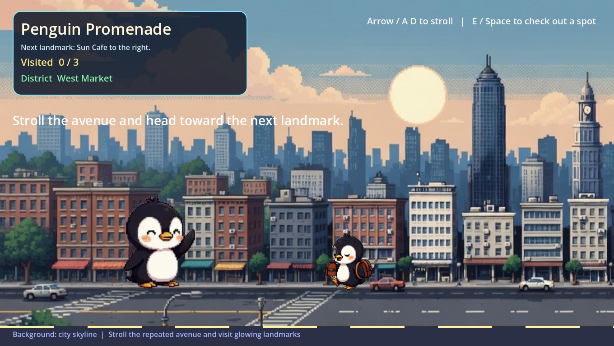

# Penguin Promenade

[](https://github.com/Sunwood-ai-labs/penguin-promenade/actions/workflows/ci.yml)
[](https://sunwood-ai-labs.github.io/penguin-promenade/)
[](https://godotengine.org/)

CLI-first experimental side-scrolling city stroll built with Godot and the Codex App.
Animated penguin WebP clips become the player, ambient NPCs, and landmark interaction poses across a looping sunset avenue.

[Japanese README](README.ja.md) | [Documentation](https://sunwood-ai-labs.github.io/penguin-promenade/) | [Issues](https://github.com/Sunwood-ai-labs/penguin-promenade/issues)

## Highlights

- Built as an experimental game app in a CLI-first workflow with Godot and the Codex App.
- Uses one dedicated animated WebP for the walking loop and repurposes the remaining WebP clips as idle, interaction, and town NPC animations.
- Ships with a headless Godot smoke test so the core promenade loop stays verifiable in CI.
- Includes `uv`-managed Python utilities for measuring visible animation bounds and keeping sprite scale alignment sane.

## Play

1. Install Godot `4.6.1` on Windows.
2. Launch the project from the repository root.

```powershell
<Path-To-Godot>\Godot_v4.6.1-stable_win64.exe --path .
```

Controls:

- `Left` / `Right` or `A` / `D`: walk through the avenue
- `E`, `Space`, or mouse click: interact with the nearest glowing landmark
- Follow the HUD to visit all three landmarks and keep wandering among the animated town penguins

## Development

Python utilities use `uv`:

```powershell
uv sync
uv run python tools\measure_animation_metrics.py assets\player_frames\run assets\tiles_frames\tile_09
```

Run the Godot smoke test from the repository root:

```powershell
<Path-To-Godot>\Godot_v4.6.1-stable_win64_console.exe --headless --path . --script res://tests/smoke_test.gd
```

Build the documentation site locally:

```powershell
cd docs
npm ci
npm run docs:build
```

Render the `v0.1.0` release-note header image in Godot:

```powershell
<Path-To-Godot>\Godot_v4.6.1-stable_win64.exe --path . --script res://tests/capture_release_notes_header.gd
```

## Project Layout

- `project.godot`: Godot project entrypoint and viewport configuration
- `scenes/main.tscn`: main playable scene
- `scripts/main.gd`: city stroll gameplay, animation wiring, NPC spawning, and HUD logic
- `tests/smoke_test.gd`: headless regression check for movement, interactions, facing, and NPC scaling
- `tests/capture_release_notes_header.gd`: headless export for the `v0.1.0` release-note header image
- `tools/measure_animation_metrics.py`: `uv` helper for measuring visible sprite bounds
- `assets/backgrounds/city.png`: skyline backdrop adapted for the promenade
- `assets/player/run_animated.webp`: dedicated player walking animation source
- `assets/player_frames/run/`: extracted PNG frames for the walking loop
- `assets/tiles/`: original animated WebP clips used for idle, action, and NPC material
- `assets/tiles_frames/`: extracted PNG sequences used at runtime
- `scenes/release_notes_header.tscn`: dedicated Godot composition scene for release-note artwork
- `scripts/release_notes_header.gd`: layout and animation wiring for the release-note header page
- `docs/`: VitePress documentation site and static media

## Asset Notes

- The project keeps the original animated WebP sources alongside extracted PNG frame sequences for runtime animation.
- Smaller town residents are randomized within a controlled range so each run feels slightly different while remaining readable.
- Sprite scale and foot placement are tuned from measured visible bounds rather than raw frame size, which keeps the player and NPC cast visually aligned.

## License

This repository is released under the [MIT License](LICENSE).
